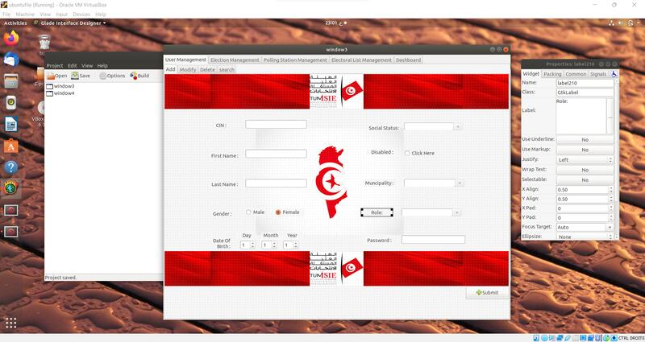

# E-Lection Desktop App

Prioritized with my team members the digitization of the voting process by developing a desktop municipality Tunisian election application in Ubuntu using the C language. 

The user-friendly interface of the application allows voters to easily navigate and accurately cast their ballots. Our goal is to enhance the integrity of elections and promote sustainability in the voting process through this innovative application.
